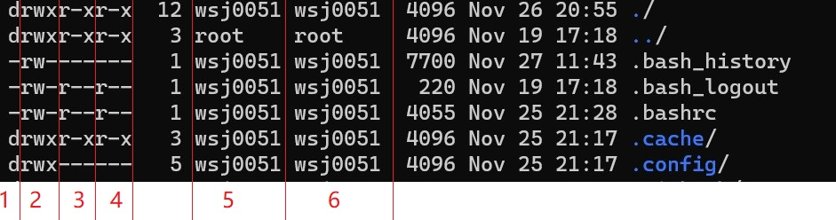

# linux
## 目录结构
+ /：根目录
+ /bin: /usr/bin: 可执行二进制文件的目录，如常用的命令ls、tar、mv、cat等。
+ /boot：放置linux系统启动时用到的一些文件，如Linux的内核文件：/boot/vmlinuz，系统引导管理器：/boot/grub。
+ /dev：存放linux系统下的设备文件，访问该目录下某个文件，相当于访问某个设备，常用的是挂载光驱 mount /dev/cdrom /mnt。
+ /etc：系统配置文件存放的目录，不建议在此目录下存放可执行文件，重要的配置文件有 /etc/inittab、/etc/fstab、/etc/init.d、/etc/X11、/etc/sysconfig、/etc/xinetd.d。
+ /home：系统默认的用户家目录，新增用户账号时，用户的家目录都存放在此目录下
+ /lib: /usr/lib: /usr/local/lib：系统使用的函数库的目录，程序在执行过程中，需要调用一些额外的参数时需要函数库的协助。
+ /lost+fount：系统异常产生错误时，会将一些遗失的片段放置于此目录下。
+ /mnt: /media：光盘默认挂载点，通常光盘挂载于 /mnt/cdrom 下，也不一定，可以选择任意位置进行挂载。
+ /opt：给主机额外安装软件所摆放的目录。
+ /proc：此目录的数据都在内存中，如系统核心，外部设备，网络状态，由于数据都存放于内存中，所以不占用磁盘空间，比较重要的目录有 /proc/cpuinfo、/proc/interrupts、/proc/dma、/proc/ioports、/proc/net/* 等。
+ /root：系统管理员root的家目录。
+ /sbin: /usr/sbin: /usr/local/sbin：放置系统管理员使用的可执行命令，如fdisk、shutdown、mount 等。与 /bin 不同的是，这几个目录是给系统管理员 root使用的命令，一般用户只能"查看"而不能设置和使用。
+ /tmp：一般用户或正在执行的程序临时存放文件的目录，任何人都可以访问，重要数据不可放置在此目录下。
+ /srv：服务启动之后需要访问的数据目录，如 www 服务需要访问的网页数据存放在 /srv/www 内。
+ /usr：应用程序存放目录，/usr/bin 存放应用程序，/usr/share 存放共享数据，/usr/lib 存放不能直接运行的，却是许多程序运行所必需的一些函数库文件。/usr/local: 存放软件升级包。/usr/share/doc: 系统说明文件存放目录。/usr/share/man:  程序说明文件存放目录。
+ /var：放置系统执行过程中经常变化的文件，如随时更改的日志文件 /var/log，/var/log/message：所有的登录文件存放目录，/var/spool/mail：邮件存放的目录，/var/run:程序或服务启动后，其PID存放在该目录下。

## 快捷键
+ 清屏：`ctrl+l`
+ 在终端在退出锁定：`ctrl+c`

## 文件权限
+ 读`r`：read
+ 写`w`：write
+ 执行`x`execute
+ `d rwx rwx rwx` 分为三组
  
  1. 文件类型
  2. 所有者的权限
  3. 用户组的权限
  4. 其他用户的权限
  5. 所有者
  6. 用户组

## 帮助
+ 命令 --help
+ man 命令

## ls命令
+ `ls 文件名`查看文件
  - `ls -a` 查看所有文件包含隐藏文件
  - `ls -l` 以列表形式查看文件，不包含隐藏文件
  - `ls -lh` 以列表形式查看文件，不包含隐藏文件 ，按照1024倍数显示{KB MB GB}
  - `ls -all`以列表形式查看文件，包含隐藏文件
  - `ll` 同上
+ 通配符：
  - `*` 匹配任意多个字符`0-256` 
    - `a*`  一个以上字符 256以下 
  - `?` 匹配任意一个字符
    - `a？` 两个字符
  - `[a-z]` 区间法 
    - 匹配a到z的所有字符，只能确定一个字符
  - `[abcde]` 穷举法
    -  匹配abcde的所有字符，只能确定一个字符


## 切换目录
+ `cd` 切换到用户主目录
+ `cd ~` 切换到当前用户的主目录
+ `cd ..` 切换到上级目录 
+ `cd .`  切换到当前目录
+ `cd -`  切换到上一次目录

## 创建目录
+ `mkdir 目录名` 创建目录
+ `mkdir 目录名 -p` 递归创建
+ `rmdir 目录名`  目录一定是空的
+ `rm 文件名`  删除文件
+ `rm 文件名 -i` 删除时询问 
+ `rm -r 目录名` 递归删除

## 链接
1. 硬链接 `ln 源文件 链接文件`
   + 硬链接文件占磁盘空间，但是删除源文件不会影响硬链接文件，与copy类似   
   + 无论你修改了哪一个链接之后的文件，两个文件都会改变保持一致，但是拷贝不会
2. 软连接 `ln -s 源文件 链接文件`
   + 软链接文件不占磁盘空间 但是删除源文件会影响软链接文件
   + 改变软链接文件就是相当于间接的改变了源文件
   + 查看文件时默认链接数为1 如果有链接依次递增
   + 如果创建的软链接文件和源文件在不同的目录下，需要使用绝对路径

## vi命令
+ `ctrl+z`放到后台
+ `jobs` 查看后台
+ `fg 编号` 唤醒

| 按键 | 功能 | 
| :-----|  :-----| 
|ZZ|退出保存|
|:wq|退出保存|
|:q!|退出不保存|
|[n]x	|删除光标后 n 个字符|
|[n]X	|删除光标前 n 个字符|
|D	|删除光标所在开始到此行尾的字符|
|[n]dd	|删除从当前行开始的 n 行（准确来讲，是剪切，剪切不粘贴即为删除）|
|[n]yy	|复制从当前行开始的 n 行|
|p	|把粘贴板上的内容插入到当前行|
|dG	|删除光标所在开始到文件尾的所有字符|
|J	|将光标所在行和下一行进行合并，中间用空格分隔|
|.	|执行上一次操作|
|u	|撤销前一个命令|
|gg|定位到行首|
|G|定位到行尾|
|:set ic	|搜寻时忽略大小写|
|:set noic	|搜寻时不忽略大小写|
|:set nu	|显示行号|
|:set nonu	|不显示行号|
|a	|光标位置右边插入文字|
|i	|光标位置当前处插入文字|
|o |光标位置下方开启新行|
|O |光标位置上方开启新行|
|I	|光标所在行首插入文字|
|A	|光标所在行尾插入文字|
|:r 文件名|在光标下一行插入一个新的文件内容|
|:s/w1/w2/g|在当前行用w2替换w1|
|:g/p1/s//p2/g|在整个文本中用p2替换p1|
|:10,20s/p1/p2/g|第10到20行所有p1用p2代替|
|/内容|查找字符串，n向下查找，N向上查找|


## 文本搜索
```
grep  '搜索内容' 文件名
```
+ 参数
  + -n 显示行号
  + -v 反选
  + -i 忽略大小写
+ 通配符
  + `^a`以a为起始的字符搜索文件
  + `a$`以a为结尾的字符搜索文件
  + `.` 配匹任意一个非换行的字符
  + `*`匹配任意字符（大于0的整数）

## 文件搜索
```
find 目录 参数 文件名
```
+ -name 文件名
+ -size 大小
+ -perm rwx

## 解压缩
tar归档
```
tar -cvf 归档文件名.tar 文件1 文件2  目录1 目录2
```
tar解归档
```
tar -xvf 归档文件名.tar  -C 路径
``` 
gzip 压缩生成一个【归档文件名.tar.gz】，文件大小小于归档文件大小，【归档文件名.tar】不存在了
```
gzip 归档文件名.tar  
```
`gzip -d` 解压生成文件【归档文件名.tar】
```
gzip -d 归档文件名.tar.gz 
```
一步归档压缩
```
tar -czvf 文件名.tar.gz 文件1 文件2 目录1 目录2
```
一步解归档压缩
```
tar -xzvf 文件名.tar.gz -C 路径
```
## bzip2压缩
```
tar -cjvf 文件名.tar.bz2 文件1 文件2 目录1 目录2
```
## bzip2解压缩
```
tar -xjvf 文件名.tar.bz2 -C 路径
```
## zip压缩
```
zip 文件名 文件1 文件2 目录1 目录2  生成一个文件为：文件名.zip
```
## unzip解压缩
```
unzip 文件名.zip -C 路径
```


