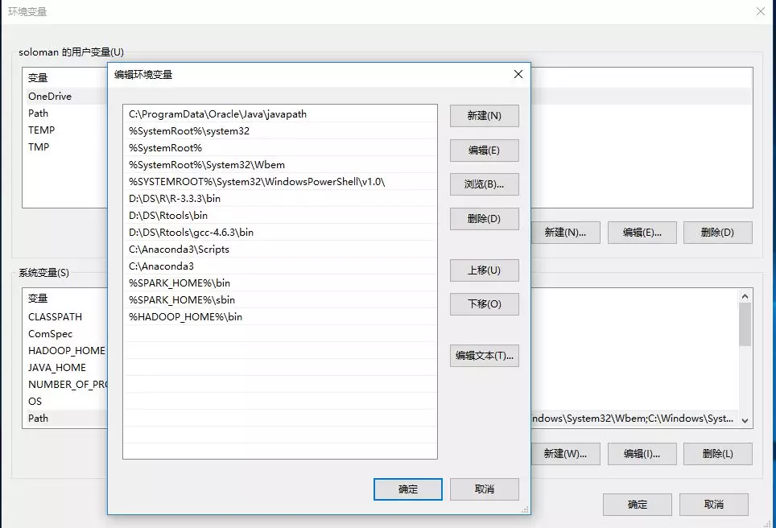

# python

## Anaconda
### 安装配置
1. 下载
    - 注意选择与操作系统匹配的版本，可根据需要下载对应版本Python的Anaconda3
    - 下载地址为：https://www.anaconda.com/download/
    - 根据安装向导逐步进行，注意安装路径中的文件夹名称不要存在空格

2. 环境变量
  系统变量PATH添加`D:\Program\anaconda3;D:\Program\anaconda3\Scripts;D:\Program\anaconda3\Library\bin;`（根据安装路径确定）
	  
	  
    【注意】此图PATH变量中也显示了后续安装过程中添加的信息

3. 测试
    - 测试Python：在cmd中输入`Python`命令，查看Python版本信息
    - 测试Conda：在cmd中输入`conda`或`pip`命令，查看具体信息
    - `conda --version`输出版本号说明设置成功
  
### 使用
1. 修改清华源
   - Windows 用户无法直接创建名为 `.condarc` 的文件，可先执行 `conda config --set show_channel_urls yes` 生成该文件之后再修改 
        ```
        channels:
        - defaults
        show_channel_urls: true
        default_channels:
        - https://mirrors.tuna.tsinghua.edu.cn/anaconda/pkgs/main
        - https://mirrors.tuna.tsinghua.edu.cn/anaconda/pkgs/r
        - https://mirrors.tuna.tsinghua.edu.cn/anaconda/pkgs/msys2
        custom_channels:
        conda-forge: https://mirrors.tuna.tsinghua.edu.cn/anaconda/cloud
        msys2: https://mirrors.tuna.tsinghua.edu.cn/anaconda/cloud
        bioconda: https://mirrors.tuna.tsinghua.edu.cn/anaconda/cloud
        menpo: https://mirrors.tuna.tsinghua.edu.cn/anaconda/cloud
        pytorch: https://mirrors.tuna.tsinghua.edu.cn/anaconda/cloud
        simpleitk: https://mirrors.tuna.tsinghua.edu.cn/anaconda/cloud
        ```
    - 运行 `conda clean -i` 清除索引缓存，保证用的是镜像站提供的索引。

2. 管理虚拟环境
   + 创建虚拟环境`code`
     ```
     conda create -n code python=3
     ```
   + 查看所有虚拟环境
     ```
     conda env list
     ```     
   + 切换环境
     ```
     activate code
     ```  
   + 删除虚拟环境
     ```
     conda remove -n aiconfig --all
     ```
   + 安装ipython
     ```
     conda install -c anaconda ipython
     ``` 
   + 退出虚拟环境`deactivate` 
3. 修改pip源
   + Windows下和conda一样修改用户目录下的pip目录下的`pip.init` `C:\Users\xxx\pip\pip.ini` 
     ```
     [global]
     index-url=http://mirrors.aliyun.com/pypi/simple/
     [install]  
     trusted-host=mirrors.aliyun.com
     disable-pip-version-check = true  
     timeout = 6000
     ```
